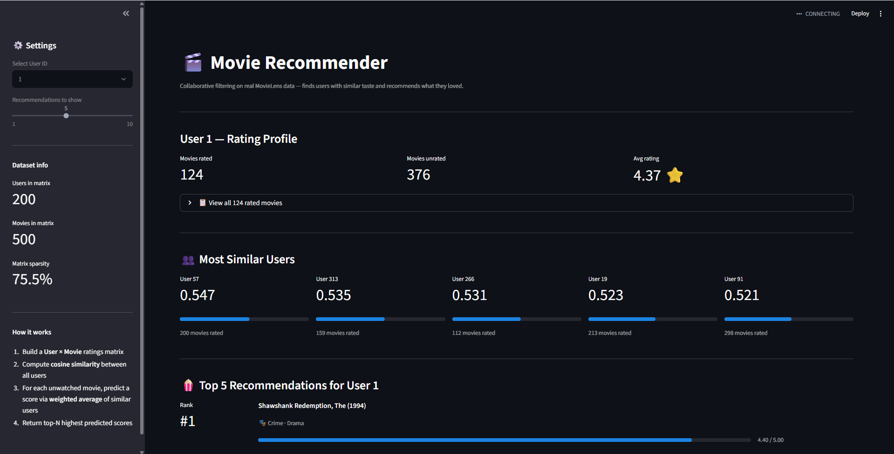

# Movie Recommender

A content-based movie recommendation system built with Python and Streamlit, powered by the [MovieLens](https://grouplens.org/datasets/movielens/) dataset. Uses **collaborative filtering** to find users with similar taste and recommend movies they loved that you haven't seen yet.

---

## How it works

1. Loads real ratings data from the MovieLens dataset (100k+ ratings)
2. Builds a User × Movie ratings matrix, filtering to active users and popular movies
3. Computes **cosine similarity** between all users
4. For each unwatched movie, predicts your rating using a **weighted average** of similar users' ratings
5. Returns the top N highest predicted scores as recommendations

---

## Demo



> Select a User ID from the sidebar, adjust the number of recommendations, and instantly see personalised movie suggestions with predicted scores.

---

## Project structure

```
movie-recommender/
├── movie_recommender_app.py   # Main Streamlit app
├── requirements.txt           # Python dependencies
├── .gitignore                 # Excludes dataset and cache files
├── README.md                  # This file
└── ml-latest-small/           # Dataset folder (download separately — see Setup)
    ├── ratings.csv
    └── movies.csv
```

---

## Setup

### 1. Clone the repository

```bash
git clone https://github.com/yourusername/movie-recommender.git
cd movie-recommender
```

### 2. Install dependencies

```bash
pip install -r requirements.txt
```

### 3. Download the dataset

Download the **MovieLens Small** dataset (~1 MB) from:
👉 https://grouplens.org/datasets/movielens/latest/

Click `ml-latest-small.zip`, unzip it, and place the `ml-latest-small/` folder inside your project directory.

Your folder should now look like:

```
movie-recommender/
├── movie_recommender_app.py
├── ml-latest-small/
│   ├── ratings.csv
│   └── movies.csv
└── ...
```

### 4. Run the app

```bash
streamlit run movie_recommender_app.py
```

Open your browser at `http://localhost:8501`

---

## Configuration

You can tune these constants at the top of `movie_recommender_app.py`:

| Constant            | Default | Description                                      |
| ------------------- | ------- | ------------------------------------------------ |
| `MIN_USER_RATINGS`  | 50      | Minimum ratings a user must have to be included  |
| `MIN_MOVIE_RATINGS` | 30      | Minimum ratings a movie must have to be included |
| `TOP_MOVIES_LIMIT`  | 500     | Max number of movies kept in the matrix          |
| `SAMPLE_USERS`      | 200     | Max number of users in the similarity matrix     |

Increasing these values improves recommendation quality but slows down the app.

---

## Tech stack

| Tool         | Purpose                                   |
| ------------ | ----------------------------------------- |
| Python       | Core language                             |
| Streamlit    | Web UI                                    |
| pandas       | Data loading and matrix building          |
| NumPy        | Vectorised similarity computation         |
| scikit-learn | Cosine similarity                         |
| MovieLens    | Ratings dataset (GroupLens Research, UMN) |

---

## Dataset

This project uses the **MovieLens Small** dataset provided by [GroupLens Research](https://grouplens.org) at the University of Minnesota.

> F. Maxwell Harper and Joseph A. Konstan. 2015. The MovieLens Datasets: History and Context. ACM Transactions on Interactive Intelligent Systems (TiiS) 5, 4: 1–19.

The dataset is not included in this repository. Download it directly from the link above.

---

## License

This project is open source and available under the [MIT License](LICENSE).
